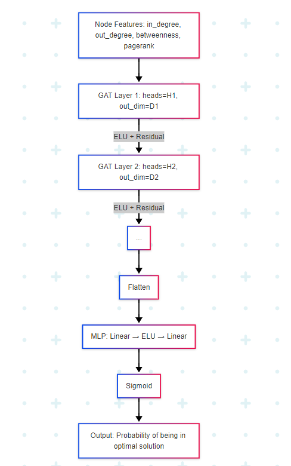
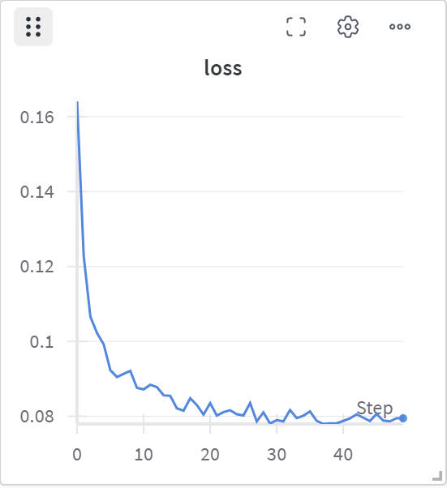

# DND Reimplementation

This project is a reimplementation of the paper:

**DND: Deep Learning-Based Directed Network Disintegrator**, IEEE JETCAS, 2023.


##  🚀 My schedule

*read and understand the paper*   
- [x] prepare the data
   you can get the data at [Huggingface](https://huggingface.co/sanyier312/DND-Reimplementation/tree/main/data/synthetic)
- [x] find out the input and output
- [x] draw the model architecture  flow chart
  
- [x] define the loss function
  
Given a graph \( G = (V, E) \), each node \( v_i \in V \) has a ground truth label \( y_i \in [0, 1] \),  
and the model predicts a value \( \hat{y}_i \in [0, 1] \).

The Mean Squared Error loss is defined as:

\[
\mathcal{L}_{\text{MSE}} = \frac{1}{|V|} \sum_{i=1}^{|V|} (y_i - \hat{y}_i)^2
\]

- [ ] define the evaluation metrics

*coding*
- [x] define the training and evaluation process
- [x] define the hyperparameters
- [x] process the data
- [x] train the model
- [ ] evaluate the model
- [ ] visualize the results


## 📌 Structure
- `model/` — GAT + MLP model
- `scripts/` — Training and evaluation scripts
- `data/` — Synthetic and real-world directed networks
- `results/` — Logs, plots, metrics

## 🔧 Dependencies

```bash
pip install -r requirements.txt
```
# 📈 Results

*train the model with  ER dataset*



