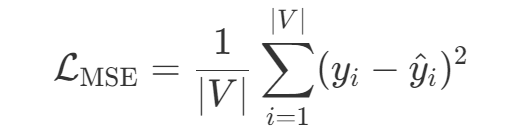
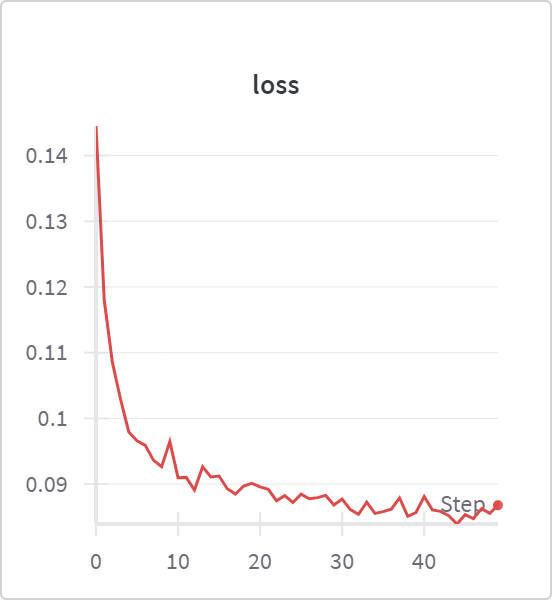

# DND Reimplementation

## 🚀 My schedule

*read and understand the paper*

- [X] prepare the data
  you can get the data at [Huggingface](https://huggingface.co/sanyier312/DND-Reimplementation/tree/main/data/synthetic)
- [X] find out the input and output
- [X] draw the model architecture  flow chart
  
- [X] define the loss function

Given a graph $G = (V, E)$, each node $v_i \in V$ has a ground truth label $y_i \in [0, 1]$,
and the model predicts a value $\hat{y}_i \in [0, 1]$.

The Mean Squared Error loss is defined as:



- [ ] define the evaluation metrics

*coding*

- [X] define the training and evaluation process
- [X] define the hyperparameters
- [X] process the data
- [X] train the model
- [ ] evaluate the model
- [ ] visualize the results

## 📌 Structure

- `model/` — GAT + MLP model
- `scripts/` — Training and evaluation scripts
- `data/` — Synthetic and real-world directed networks
- `results/` — Logs, plots, metrics

## 🔧 Dependencies

```bash
pip install -r requirements.txt
```

# 📈 Results

*train the model with  ER dataset*


*train the model with  SBM dataset*




